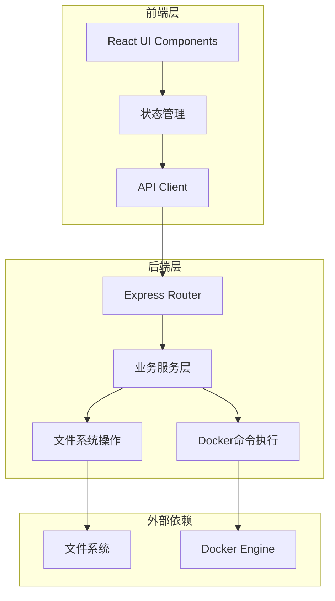
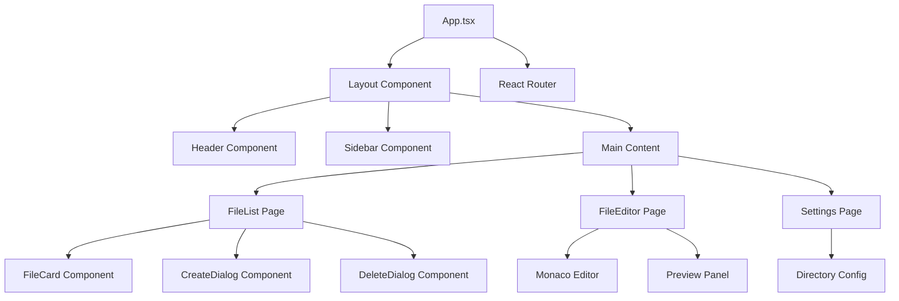

# Design Document

## Overview

Docker Compose管理系统是一个基于Web的全栈应用，采用现代化技术栈构建。系统通过pnpm单仓架构管理前后端代码，前端使用React + TypeScript + Vite + Tailwind CSS + shadcn-ui构建现代化用户界面，后端使用Node.js + TypeScript提供RESTful API服务。系统无需数据库，所有配置信息通过文件系统管理，支持对指定目录下的Docker Compose文件进行完整的CRUD操作和生命周期管理。

## Architecture

### 系统架构图



### 技术栈选择

**前端技术栈：**
- React 18 - 现代化UI框架
- TypeScript - 类型安全
- Vite - 快速构建工具
- Tailwind CSS - 原子化CSS框架
- shadcn-ui - 现代化组件库
- Lucide React - 现代化图标库
- React Query - 数据获取和缓存
- Zustand - 轻量级状态管理
- React Hook Form - 表单管理
- Monaco Editor - 代码编辑器

**后端技术栈：**
- Node.js - 运行时环境
- TypeScript - 类型安全
- NestJS - 企业级Node.js框架
- CORS - 跨域支持
- js-yaml - YAML解析
- child_process - 执行Docker命令

**开发工具：**
- pnpm - 包管理器和workspace管理
- ESLint - 代码规范
- Prettier - 代码格式化
- Husky - Git hooks

## Components and Interfaces

### 前端组件架构



### 核心组件说明

**FileList Component:**
- 显示Docker Compose文件列表
- 支持文件状态显示（运行中/已停止）
- 提供启动/停止/编辑/删除操作
- 实时状态更新

**FileEditor Component:**
- 基于Monaco Editor的YAML编辑器
- 实时语法验证和高亮
- 支持自动补全和错误提示
- 预览面板显示解析后的配置

**FileCard Component:**
- 单个Docker Compose文件的卡片展示
- 显示文件基本信息和状态
- 提供快速操作按钮

### API接口设计

**RESTful API端点：**

```typescript
// 文件管理接口
GET    /api/files              // 获取所有Docker Compose文件（包含状态信息）
POST   /api/files              // 创建新文件
GET    /api/files/:filename    // 获取单个文件内容
PUT    /api/files/:filename    // 更新文件内容
DELETE /api/files/:filename    // 删除文件

// 服务管理接口
POST   /api/services/:filename/start   // 启动服务
POST   /api/services/:filename/stop    // 停止服务
```

**数据传输对象（DTO）：**

```typescript
interface DockerComposeFile {
  filename: string;
  path: string;
  content: string;
  lastModified: Date;
  status: 'running' | 'stopped' | 'error' | 'unknown';
  services: string[];
}

interface ServiceStatus {
  filename: string;
  status: 'running' | 'stopped' | 'error';
  containers: ContainerInfo[];
}

interface ContainerInfo {
  name: string;
  status: string;
  ports: string[];
  image: string;
}

interface SystemConfig {
  composeDirectory: string;
  autoRefresh: boolean;
  logLevel: 'debug' | 'info' | 'warn' | 'error';
}
```

## Data Models

### 文件系统数据模型

系统不使用传统数据库，而是基于文件系统进行数据管理：

**目录结构：**
```
/configured-directory/
├── docker-compose.yml
├── docker-compose.yaml
├── project1/
│   └── docker-compose.yml
└── project2/
    └── docker-compose.yaml
```

**环境变量配置：**
```typescript
// .env 配置文件
interface EnvConfig {
  COMPOSE_DIRECTORY: string;    // Docker Compose文件存储目录
  PORT: number;                 // 后端服务端口
  LOG_LEVEL: string;           // 日志级别
}
```

**文件元数据缓存：**
```typescript
// 内存中的文件状态缓存
interface FileCache {
  [filename: string]: {
    lastModified: Date;
    status: ServiceStatus;
    parsedContent: any;
    validationErrors: string[];
  };
}
```

### 状态管理模型

**前端状态结构：**
```typescript
interface AppState {
  files: {
    list: DockerComposeFile[];
    loading: boolean;
    error: string | null;
  };
  ui: {
    selectedFile: string | null;
    sidebarOpen: boolean;
    theme: 'light' | 'dark';
  };
}
```

## Error Handling

### 错误分类和处理策略

**1. 文件系统错误：**
- 目录不存在或无权限访问
- 文件读写失败
- 磁盘空间不足

处理策略：
- 提供友好的错误提示
- 自动重试机制
- 降级到只读模式

**2. Docker相关错误：**
- Docker服务未启动
- Docker Compose命令执行失败
- 容器启动失败

处理策略：
- 检测Docker环境可用性
- 显示详细的错误日志
- 提供故障排除建议

**3. YAML解析错误：**
- 语法错误
- 格式不正确
- 缺少必需字段

处理策略：
- 实时语法验证
- 高亮错误位置
- 提供修复建议

**4. 网络和API错误：**
- 前后端连接失败
- API请求超时

处理策略：
- 自动重试机制
- 错误边界组件
- 友好的错误提示

### 错误处理实现

**NestJS错误处理：**
```typescript
interface ApiError {
  code: string;
  message: string;
  details?: any;
  timestamp: Date;
}

@Catch()
export class GlobalExceptionFilter implements ExceptionFilter {
  catch(exception: unknown, host: ArgumentsHost) {
    const ctx = host.switchToHttp();
    const response = ctx.getResponse();
    
    const apiError: ApiError = {
      code: exception.constructor.name,
      message: exception.message,
      timestamp: new Date()
    };
    
    // 记录错误日志
    Logger.error(apiError);
    
    // 返回适当的HTTP状态码
    response.status(this.getStatusCode(exception)).json(apiError);
  }
}
```

**前端错误边界：**
```typescript
class ErrorBoundary extends React.Component {
  state = { hasError: false, error: null };
  
  static getDerivedStateFromError(error: Error) {
    return { hasError: true, error };
  }
  
  render() {
    if (this.state.hasError) {
      return <ErrorFallback error={this.state.error} />;
    }
    return this.props.children;
  }
}
```
